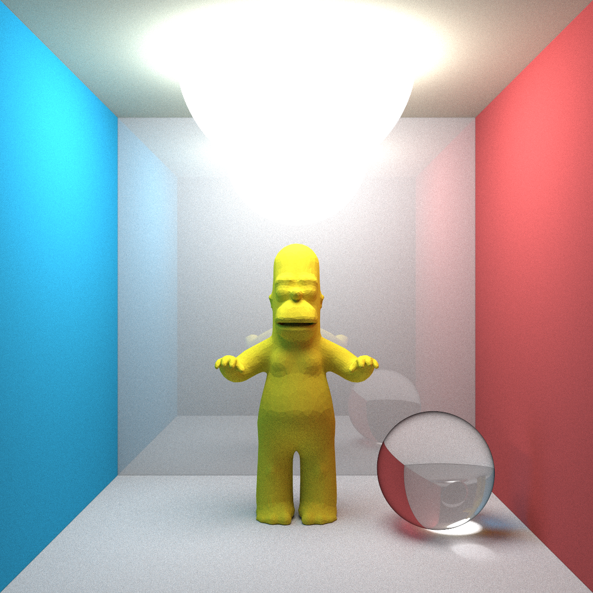
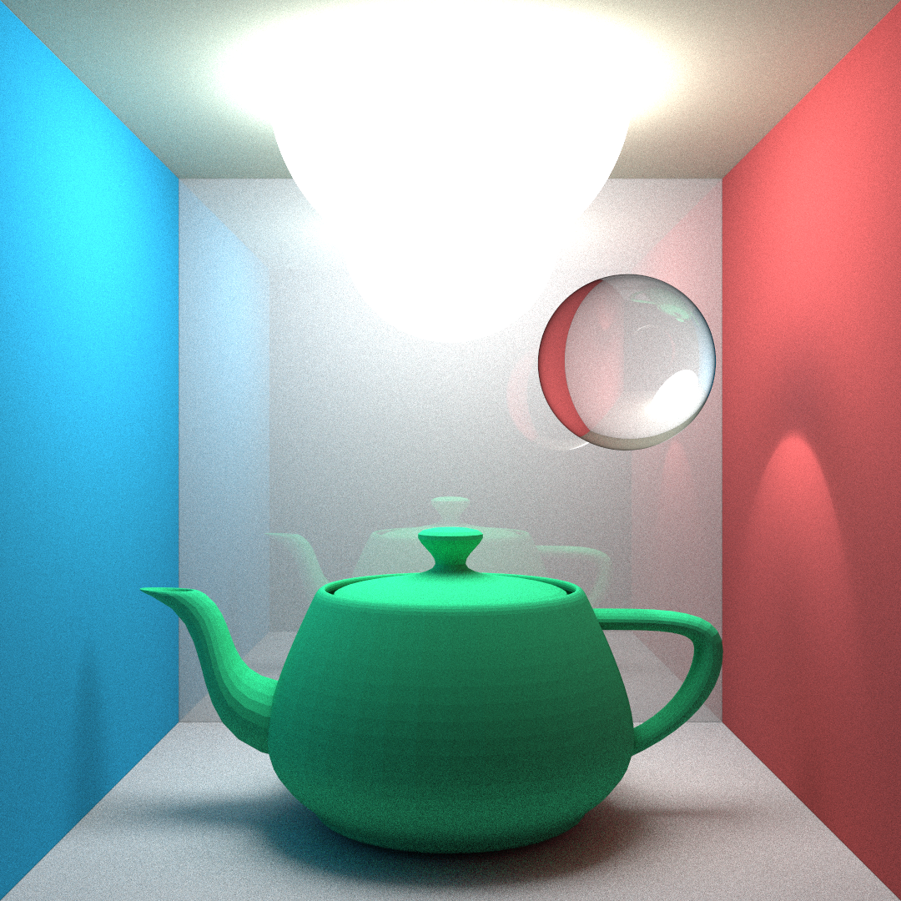

# Pathtracer

Homer scene (5000 samples) |  Teapot scene (3000 samples)
:-------------------------:|:-------------------------:
  |  

- A naive Monte Carlo Pathtracer written in Rust supporting:
    - YAML & Obj parser 
    - Multi-threading
    - Iterative rendering
    - AABB (Axis-aligned bounding box) for meshes
    - Diffuse & Reflection & transparent material (with Fresnel)
- To run an example scene using:
    - pahtracer: `cargo run --release -- -s 1 -c 8 -r pathtracer example/pathtracer/cornel_box.yml`
    - raytracer: `cargo run --release -- -s 1 -c 8 -r raytracer example/raytracer/cornel_box.yml`
- For help: `cargo run --release -- -h`
- Sources:
    - [Scratchapixel](https://www.scratchapixel.com/)
    - [Smallpt](https://www.kevinbeason.com/smallpt/#:~:text=smallpt%20is%20a%20global%20illumination,(click%20for%20full%20size).)
    - [Obj model](https://github.com/alecjacobson/common-3d-test-models)
